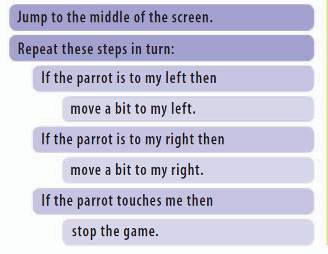

Chapter 1: 게임이란
===================================

컴퓨터 게임에 대해서 알아 보도록 합시다.

좋은 게임을 만들기 위해서는 다음과 같은 요소들이 필요로 합니다.

캐릭터
----------------------
게임 세계에 들어가면 사람이든 동물이던 게임을 행하게 되는 주인공이 캐릭터이다.
위험성이나 경쟁을 위해서 상대 또는 적개념의 캐릭터도 이용된다.

오브젝트
----------------------
모든 게임에 활용되는 모든것들을 말한다.
모든 게임에는 문을 여는 열쇠 또는 건강점수를 위해 별과 동전과 같은 객체가 사용된다.
모든 객체는 좋은것만은 아니다. 어떨때는 플레이를 방해해서 건강을 해롭게 하거나
물건을 빼앗아 가게 된다.
객체는 플레이어가 마지막 단계까지 가도록 함께 퍼즐을 만들어 냅니다.

메카닉스
----------------------

게임에서는 달리기,점프,날기,객체 캡처,주문사용,무기사용등 행동에 해당하는 낱말이 있습니다.
잘 설계된 역학은 좋은 게임을 만든다.

규칙(룰)
----------------------

게임의 규칙들은 플레이어에게 해야 될것과 하지 말아야 될것들에 대해서 말하고 있다.
예를 들면 벽을 통과할수 있습니까? 그것들은 당신의 길을 방해 합니까?
당신은 멈추고 생각할 수 있습니까?

목표
----------------------
모든 게임은 도전을 통해 어떤 목표에 도달하도록 한다.
게임을 이기는 것이든,적을 정복하든,높은 점수를 획득하던,가능한 오랫동안 유지하고 있던간에 말이다.
대부분의 게임은 수많은 작은 목표들을 가지고 있다.

컨트롤
----------------------
키보드,마우스,조이스틱,모션센서등은 좋은 콘트롤러가 된다.
플레이어가 게임 캐릭터를 완벽하게 조정할 수 있을때 재미가 있다.
따라서 컨트롤은 쉽게 익히고 컴퓨터가 빠르게 응답을 해야 된다.

게임세계
----------------------
게임이 플레이 되는 세계를 생각해 보자.
그것은 2D 또는 3D로 되어 있는가?
플레이어는 위에서 바라볼 수 있는가?
플레이어를 제한하기 위해 경계나 벽을 가지고 있는가?
야외처럼 열려있는 공간인가?

어려운 레벨
----------------------
게임이 너무 쉽거나 너무 어려우면 게임이 재미가 없다.
많은 게임들은 시작과 동시에 도전을 쉽게 만들고 있다.
게임을 익히는 동안 플레이어가 좀더 향상된 스킬로 갔을때
좀더 어려운 레벨등을 만든다.
올바른 어려운 레벨을 만드는것이 좋은 게임의 열쇠이다.

분위기
----------------------
책과 영화와 같이 좋은 게임은 당신을 끌어 들이고 당신이 어떤 환경에서 느낄 방법들을 변화시킵니다.
여기에 게임 디자이너가 사용하는 몇가지 방법들을 소개합니다.

스토리텔링
~~~~~~~~~~~~~~

소리
~~~~~~~~~~~~~~

빨리 빨리
~~~~~~~~~~~~~~

색깔변화
~~~~~~~~~~~~~~

그래픽
~~~~~~~~~~~~~~

게임 종류
----------------------
모든 게임은 형태와 크기가 존재한다.
대략 다음의 정도로 구분한다.

정통적인 게임
~~~~~~~~~~~~~~

롤플레이 게임
~~~~~~~~~~~~~~

레이싱 게임
~~~~~~~~~~~~~~

.. image:: ./img/chapter1-16.png

샌드박스 게임
~~~~~~~~~~~~~~

전투 게임
~~~~~~~~~~~~~~

전략 게임
~~~~~~~~~~~~~~

음악댄스 게임
~~~~~~~~~~~~~~

시뮬레이션 게임
~~~~~~~~~~~~~~~~~~

스포츠 게임
~~~~~~~~~~~~~~

퍼즐 게임
~~~~~~~~~~~~~~

코딩의 원리
----------------------
컴퓨터는 스스로 생각할 수 없다. 암묵적으로 어떠한 일련의 명령을 통해 동작된다.
무엇을 하고 어떤 순서대로 해야하는지 작은 조각으로 나누어져 있다면 아주 복잡한 업무도 수행할 수 있다.
이러한 컴퓨터가 이해하는 언어로 명령을 쓰는 작업을 코딩이라고 한다.

게임 계획하기
~~~~~~~~~~~~~~
간단한 게임을 만든다고 생각하자.
앵무새가 강을 건너는 게임인데 화난 사자를 피해서 사과를 모으는 게임이다.
앵무새, 사과, 사자는 어떻게 해야 할지 한번 알아 보자.

사과
~~~~~~~~~~~~~

앵무새
~~~~~~~~~~~~~

사자
~~~~~~~~~~~~~

