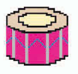
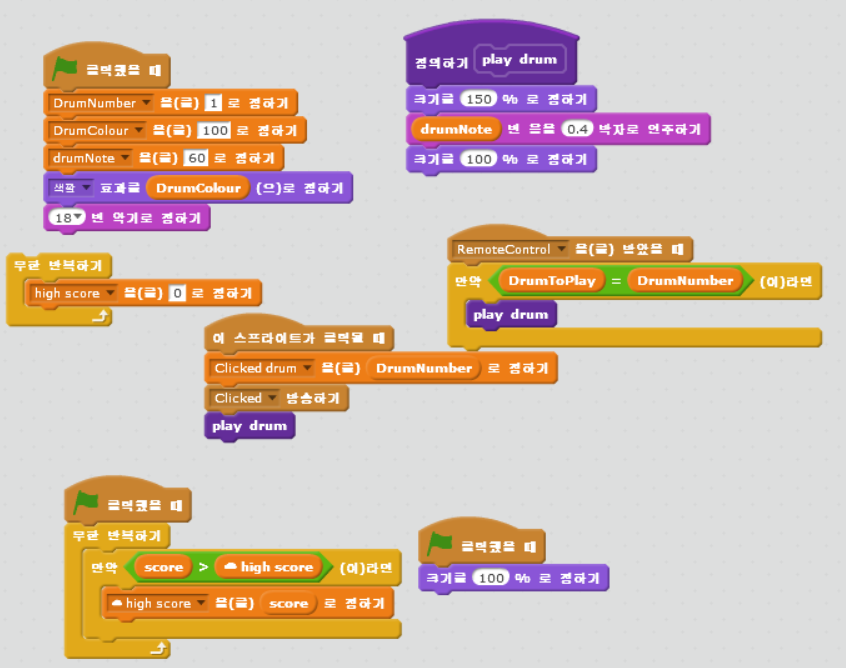
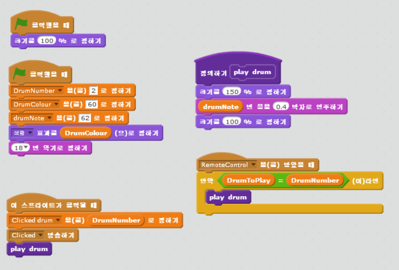
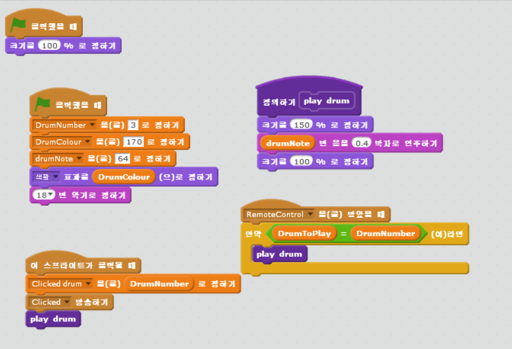
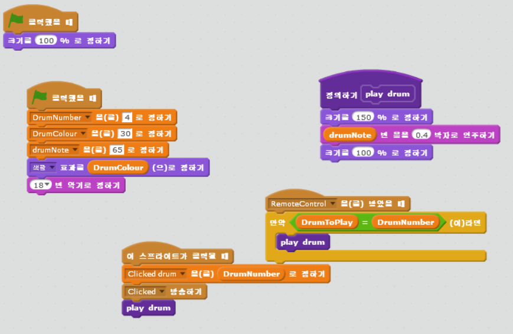

chapter 10: 열대지방 음악
=============================
이 경기는 얼마나 기억력이 있는가를 알아보는 게임이다.

게임의 목적
---------------------------------
음악 매치를 하는 게임이다.
가장 맞는 음악을 선택하면 이기게 되고 실수 하면 게임 오버가 된다.

스프라이트는 다음과 같다.

음악듣기
~~~~~~~~~~

드럼
~~~~~~~~~~

게임오버
~~~~~~~~~~~

드럼 만들기
~~~~~~~~~~~~~~~~
스프라이트를 모두 드럼으로 하고 다음과 같이 코딩을 한다.

드럼1

드럼2

드럼3

드럼4

