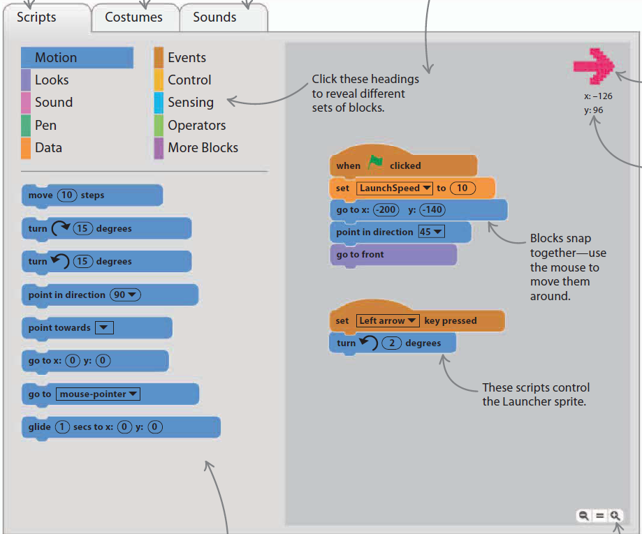

chapter 2: 스크래치 입문
=================================

스크래치에 대해서 알아 보도록 하자.
스크래치는 그래픽 프로그램 언어로 배우기 쉽고 어느 복잡한 프로그램을 이미 만들어진 프로그램으로
쉽게 실행할 수 있다.

2.1 스크래치로 시작하기
------------------------------------
스크래치 프로젝트는 보통 오브젝트나 스프라이틀를 선택하는것으로 시작한다.
스크래치는 많은 종류의 스프라이트를 제공하고 본인이 직접 만들어도 된다.

스프라이트
~~~~~~~~~~~~~~~~~~~~

스프라이트는 게임에서 움직이고 행동하는 캐릭터이다.
그것들은 동물부터 시작해서 사람, 피자등도 가능하다.
이 스프라이트는 스크립트를 이용해서 스크린에 나타낼수 있고 사라지게 할 수 있다.

스크립트
~~~~~~~~~~~~
퍼즐과 같이 프로그래밍 하는 것을 스크립트라고 한다.

.

프로그램 실행하기
~~~~~~~~~~~~~~~~~~
시작하기 또는 프로그램 실행하기를 시작하면 만들어 놓은 스크립트가 동작할 준비가 된다.
풀 스크린을 위해서는 왼쪽 상단의 푸른색 버튼을 누르면 큰 화면으로 볼 수 있다.

스프라이트 움직이기
~~~~~~~~~~~~~~~~~~~
전형적인 게임에서는 플레이어가 캐릭터를 움직이고 또다른 캐릭터는 자동으로 프로그램되어 있는대로 움직인다.
아래 스크립트는 프로젝트에 있는 공룡이 고양이를 쫓아 가도록 되어 있다.

.. image:: ./img/chapter2/chapter2-1.png

2.2 온라인 스크래치
------------------------------------

브라우저에서 scratch.mit.edu 를 치고 들어가 보자.

2.3 오프라인 스크래치
------------------------------------

온라인으로 연결해서 하지 않고 로컬 PC에서 실행하는 프로그램을 의미한다.

인스톨
~~~~~~~~~~~~~
브라우저에 https://scratch.mit.edu/scratch2download 에서 받을 수 있다.

현재 1.4 ,2.0 버젼이 있고 3.0 버젼은 오픈 예정에 있다.

실행하기
~~~~~~~~~~~~~~
스크래치 아이콘을 클릭하면 실행하게 된다.
스크래치는 윈도우,맥컴퓨터,우분투 OS에서 잘 동작을 한다.
마우스와 키보드로 동작을 하며 피지컬 컴퓨팅을 위해서 여러가지 센서등으로도 동작이 된다.
그리고 프로젝트를 저장할 수도 있다.

2.4 스크래치 살펴보기
------------------------------------
스크래치는 다음과 같이 구성되어 있다.

