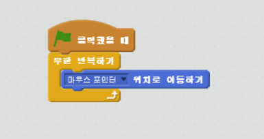
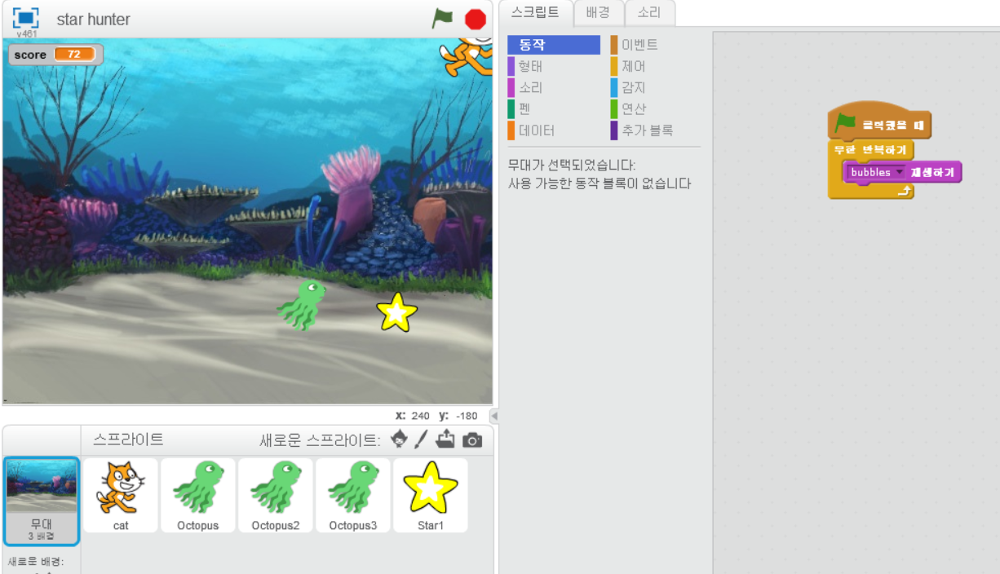
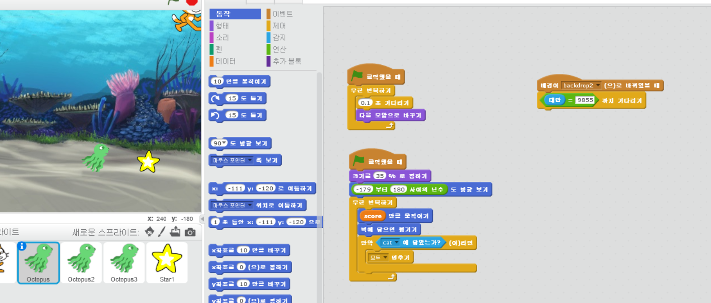
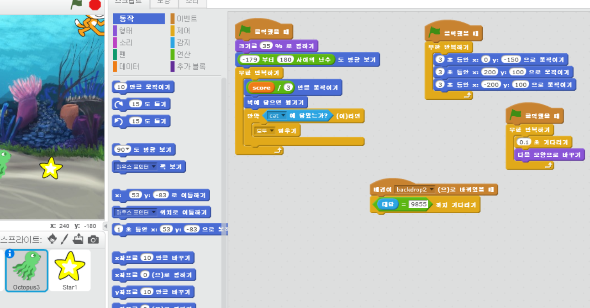
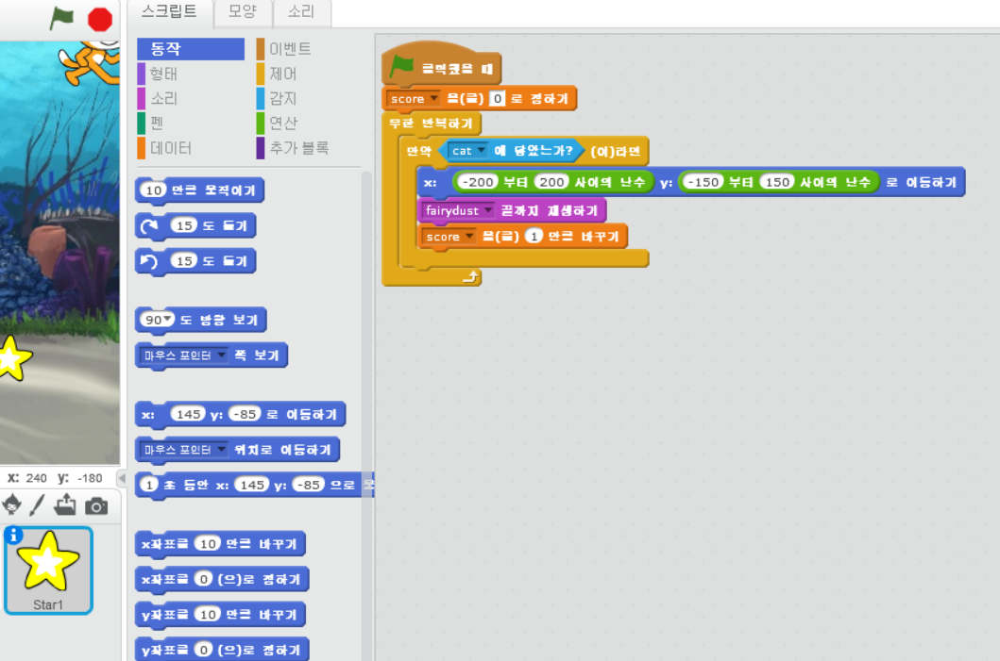

chapter 3: 스타헌터
=======================
게임 만들기에 들어오신 것을 환영합니다.
여기서 안내하는대로 하나씩 해보면 간단한 게임을 만들 수 있다.

게임의 목적
-----------------------

이 게임은 최대한 많은 별을 모으는 게임이다.
별을 모으기 위해 고양이를 이용하고 위험한 문어를 피해야 한다.

게임에 사용되는 스프라이트는 다음과 같다.

고양이
~~~~~~~~~~~
고양이는 마우스 포인터를 쫓아 가게 만든다.

문어
~~~~~~~~~~~~~
자유롭게 바다를 헤험쳐 다닌다.

별
~~~~~~~~~~~~~~
임의의 장소에 나타나서 그것을 터치하면 포인트가 쌓이게 된다.

스크립트 만들기
~~~~~~~~~~~~~~~~
블럭들은 여러가지 색깔별로 각기 무엇을 할것인가에 대한 명령이 되어 있다.

여기서는 고양이가 계속 마우스를 쫓아가는 행동을 해보도록 하자.
그리고 배경음악으로 물소리가 나오도록 다음처럼 코딩을 해보자.

배경 만들기
~~~~~~~~~~~~~~~~
이젠 배경 화면을 만들어 보자.
왼쪽 하단에 배경을 클릭해 보자.
배경화면에 계속 물소리가 나도록 코딩을 해보자.

적 만들기
~~~~~~~~~~~~~~~~
이젠 문어에게 명령을 해보도록 하자.
계속 움직이는 모습을 해야 하고 조금씩 움직이다가 벽에 닿았을 경우 튕기도록 하자.
그리고 고양이와 닿았을때 게임이 멈추도록 하자.

적 더 만들기
~~~~~~~~~~~~~~~~
하나의 문어를 만들었으면 클릭해서 복사하기를 하면 그대로 복사가 된다.
이름만 바꿔주면 된다.
그리고 다른 문어는 다른 방향에서 시작하도록 설정해 보자.

별 모으기
~~~~~~~~~~~~~~~~
고양이가 별을 닿으면 별은 다른곳에 움직이도록 해보자.

스코어 유지하기
~~~~~~~~~~~~~~~~
스코어 변수는 데이터 만들기에서 만들어서 별을 닿았을때 1씩 증가하도록 설정한다.

