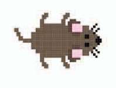
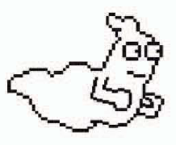

chapter 4: 치즈 쫓아가기
==========================
세계적으로 최초이고 가장 많은 인기를 끄는 게임이 미로 게임이다.
미로게임은 유령을 피해서 보물을 줍워서 빠른 시간에 통과하는것이 관건이다.

게임의 목적
-----------------------------------
배고픈 생쥐가 미로에 있다.치즈를 찾아서 가는데 사악한 벌레들을 피해가야 한다.그리고 유령도 조심해야 한다.

게임에 사용되는 스프라이트는 다음과 같다.

생쥐
~~~~~~~~~~~

벌레
~~~~~~~~~~~

.. image:: ./img/chapter4/chapter4-2.png

유령
~~~~~~~~~~~

키보트 컨트롤
~~~~~~~~~~~~~~~~
게임 콘트롤로 마우스든 키보드 또는 조이스틱을 많이 쓰는데 여기서는 키보드를 사용해보도록 하자.
각 키보드에 동작에 따라서 방향성과 움직임을 설정하면 된다.

.. image:: ./img/chapter4/chapter4-4.png

페이트 에디터 사용하기
~~~~~~~~~~~~~~~~~~~~~

고스트 스크립트 짜기
~~~~~~~~~~~~~~~~~~~

생쥐 만들기
~~~~~~~~~~~~~~~~

마우스 트랩 만들기
~~~~~~~~~~~~~~~~

벌레 만들기
~~~~~~~~~~~~~~~~

메세지 보내기
~~~~~~~~~~~~~~~~

스코어 적기
~~~~~~~~~~~~~~~~

게임 오버
~~~~~~~~~~~~~~~~
