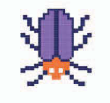
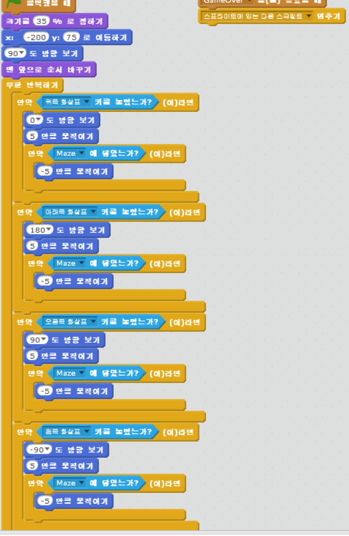
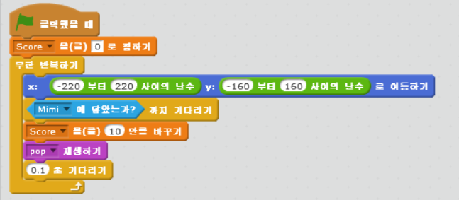
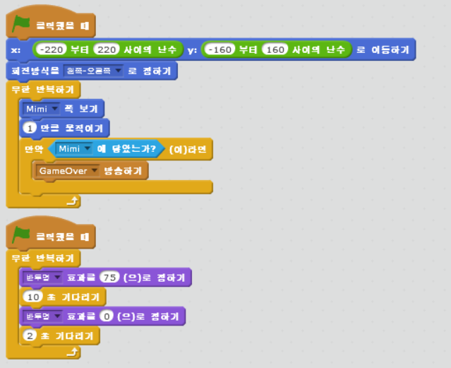
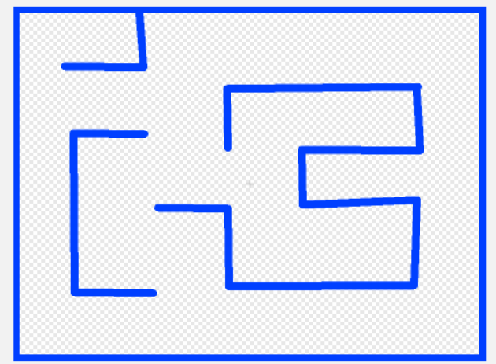
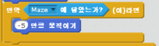

chapter 4: 치즈 쫓아가기
==========================
세계적으로 최초이고 가장 많은 인기를 끄는 게임이 미로 게임이다.
미로게임은 유령을 피해서 보물을 줍워서 빠른 시간에 통과하는것이 관건이다.

게임의 목적
-----------------------------------
배고픈 생쥐가 미로에 있다.치즈를 찾아서 가는데 사악한 벌레들을 피해가야 한다.그리고 유령도 조심해야 한다.

게임에 사용되는 스프라이트는 다음과 같다.

생쥐
~~~~~~~~~~~

.. image:: ./img/chapter4/chapter4-1.png

벌레
~~~~~~~~~~~

유령
~~~~~~~~~~~

.. image:: ./img/chapter4/chapter4-3.png

키보트 컨트롤
~~~~~~~~~~~~~~~~
게임 콘트롤로 마우스든 키보드 또는 조이스틱을 많이 쓰는데 여기서는 키보드를 사용해보도록 하자.
각 키보드에 동작에 따라서 방향성과 움직임을 설정하면 된다.

페인트 에디터 사용하기
~~~~~~~~~~~~~~~~~~~~~~~~

스프라이트나 기타 그림들은 스크래치에서 기본 제공하는 그림 그리기를 이용해서 만들 수 있다.
여기서는 간단히 이미 그려져 있는 스프라이트를 불러서 이용하자.
치즈에 대한 스크립트는 다음과 같다.
마우스가 치즈에 닿으면 점수를 올리고 pop 음을 재생한다.

고스트 스크립트 짜기
~~~~~~~~~~~~~~~~~~~~~~~~
이 프로젝트에 첫번째 적을 넣는것은 치즈 쫓기 게임을 적당한 게임으로 만들어 줄것이다.
유령은 벽을 지나갈 수 있으므로 이 게임에서 적으로 적합할 것이다.
유령의 스크립트는 다음과 같다.
마우스를 보고 조금씩 계속 움직이는 스크립트이다.

미로 만들기
~~~~~~~~~~~~~~~~
미로는 페인트로 여러가지를 만들 수 있다.

마우스 트랩 만들기
~~~~~~~~~~~~~~~~~~~~~
마우스 트랩으로 마우스가 벽에 닿으면 -5씩 뒤로 움직이도록 해보자.

벌레 만들기
~~~~~~~~~~~~~~~~
벌레는 제한된 장소를 왔다 갔다 하는 정도로 코딩을 해보자.
벽에 닿으면 뒤로 후퇴하고 마우스에 닿으면 게임 오버이다.

메세지 보내기
~~~~~~~~~~~~~~~~
여기서는 게임이 종료했을때 다른 스프라이트나 화면들이 처리할 수 있도록 메세지 보내는 법을 배우도록 하자.
이벤트의 방송하기를 쓰면 되고 보내는 부분과 받는 부분이 있다.

스코어 적기
~~~~~~~~~~~~~~~~
스코어는 데이터에서 변수를 만들어야 한다.
치즈를 닿았을 경우 점수가 올라가도록 하는 코딩을 해보자.

게임 오버
~~~~~~~~~~~~~~~~
게임오버는 게임에서 졌을 경우 나타 나도록 커다란 글씨로 만들면 된다.
여기서는 이미 만든 스프라이트를 불러서 사용해 보자.

스크립트는 브로드캐스팅 메세지를 받았을때 다음처럼 처리하면 된다.

