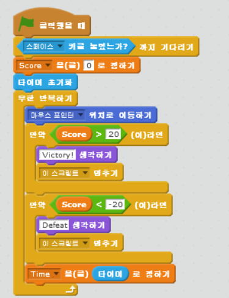
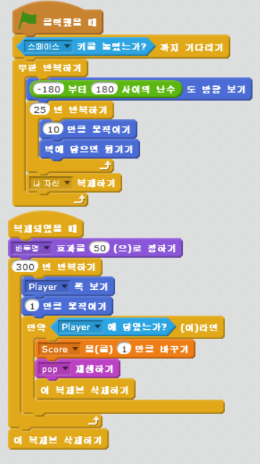
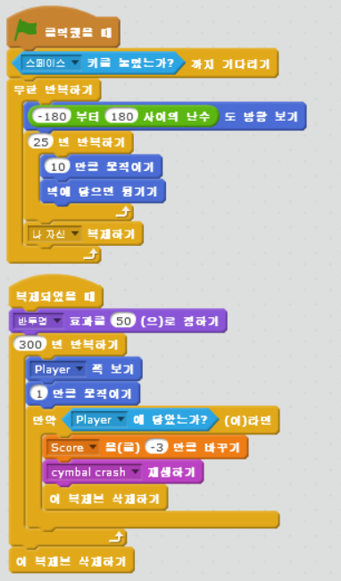
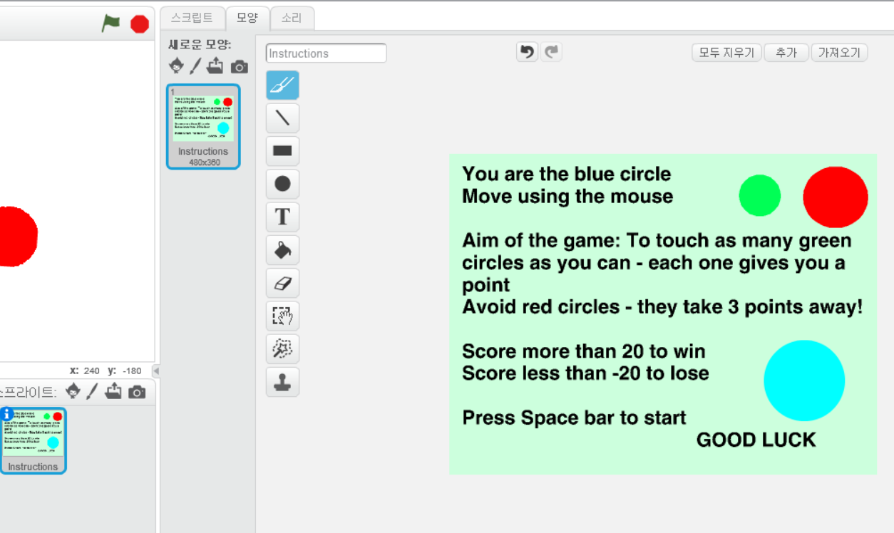
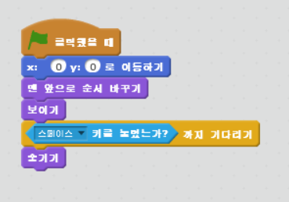

chapter 5: 원 그리기
=======================

게임의 목적
------------------------------------

마우스를 이용해서 스크린의 파란색 원을 움직인다.녹색원을 최대한 많이 모으고 적색은 피해야 한다.
20 포인트가 되면 이기고 -20 포인트가 되면 지게 된다.

스프라이트는 다음과 같다.

player
~~~~~~~~~~~~~~~~~~

Friends
~~~~~~~~~~~~~~~~~

Enemies
~~~~~~~~~~~~~~~~~

스프라이트 만들기
~~~~~~~~~~~~~~~~~~~~
플레이어의 기본적 스크립트는 다음과 같다.

친구와 적 만들기
~~~~~~~~~~~~~~~~
친구에 대한 스크립트는 다음과 같다.

적에 대한 스크립트는 다음과 같다.

명령 가이드 만들기
~~~~~~~~~~~~~~~~~~~~
명령 가이드는 다음처럼 만든다.

그리고 스크립트는 다음처럼 만들면 된다.

