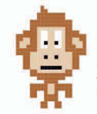
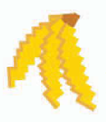
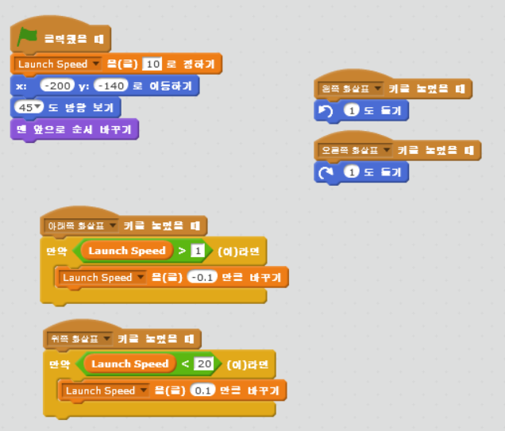
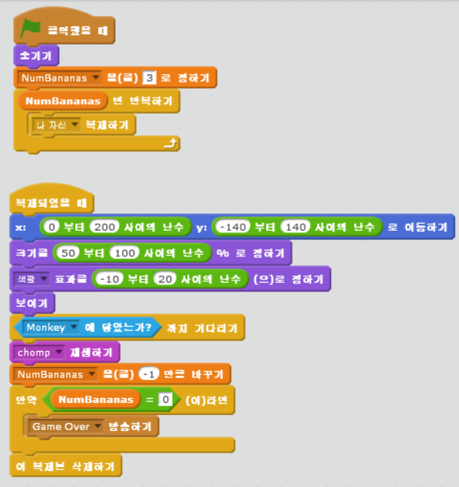
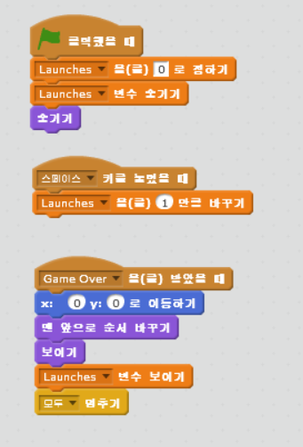
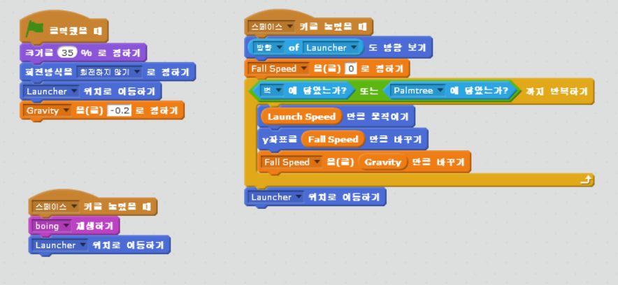

chapter 6: 뛰어 오르는 원숭이
======================================
실 생활에서는 깰 수 없는 법칙이 있다.
예를 들면 중력의 법칙이란것은 어떤것이 올라가게 되면 떨어지는 것을 의미한다.
뛰어 오르는 원숭이 게임은 이것을 이용한 것이다.

게임의 목적
------------------------------

원숭이가 최대한 바나나늘 습득하는 게임이다.
가능한 원숭이가 잘 잡을 수 있도록 던져주는 게임이다.

스프라이트는 다음과 같다.

런처
~~~~~~~~~~~~~~~

원숭이
~~~~~~~~~~~~~~~

바나나
~~~~~~~~~~~~~~~

원숭이 발사하기
~~~~~~~~~~~~~~~~~~~
런처에 대한 스크립트는 다음과 같다.

바나나와 팜나무 만들기
~~~~~~~~~~~~~~~~~~~~~~~~
바나나는 복제하기를 만들고 원숭이가 닿으면 하나씩 줄어드는 스크립트를 짜야 한다.

게임오버 만들기
~~~~~~~~~~~~~~~~~~~
게임 오버는 다음과 같이 만든다.

원숭이
~~~~~~~~~~~~~~~~~~~
원숭이는 다음과 같이 코딩한다.

