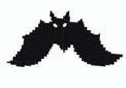
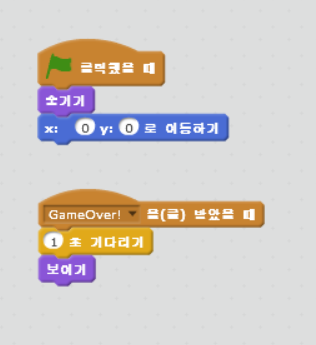

chapter 7: 빗자루에 달린 운명
================================

이 게임은 빗자루를 탄 마녀가 박쥐,유령,용을 무찌르는 게임이다.

게임의 목적
-------------------------------

마녀가 빗자루를 타고 가면서 유령과 박쥐등을 피하거나 부수는 게임이다.

스프라이트는 다음과 같다.

마녀
~~~~~~~~~~~~

적들
~~~~~~~~~~~~

살아있는것
~~~~~~~~~~~~

배경화면 설정하기
~~~~~~~~~~~~~~~~
배경화면은 리소스 디렉토리에서 이미지를 찾아 해보도록 하자.

스크립트는 다음과 같다.

.. image:: ./img/chapter7/chapter7-5.png

마녀 조정하기
~~~~~~~~~~~~~~~~
마녀의 스크립트는 다음과 같다.

.. image:: ./img/chapter7/chapter7-6.png

박쥐 공격하기
~~~~~~~~~~~~~~~~
박쥐는 일단 움직임을 나타내야 한다.

박쥐의 스크립트는 다음과 같다.

불 뿜는 용 만들기
~~~~~~~~~~~~~~~~
용은 다음과 같이 코딩한다.

유령 만들기
~~~~~~~~~~~~~~~~
유령은 다음과 같이 코딩한다.

게임 오버 만들기
~~~~~~~~~~~~~~~~
게임오버 코딩은 다음과 같다.

