chapter 8: 강아지의 저녁
===========================
플랫폼을 건너서 강아지가 좋아하는 것을 얻고 적이나 함정을 피해가는 게임이다.

게임의 목적
------------------------------

강아지가 스테이지를 옮기면서 자기가 좋아하는 뼈를 모으는 게임이다.

스프라이트는 다음과 같다.

강아지
~~~~~~~~~~

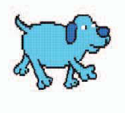

뼈
~~~~~~~~~

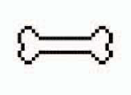

정크푸드
~~~~~~~~~

.. image:: ./img/chapter8/chapter8-3.png

플레이어 플랫폼
~~~~~~~~~~~~~~~~
출발 플랫폼을 만들어 보자.
그리고 함수를 사용하여 다음과 같이 스크립트를 짠다.

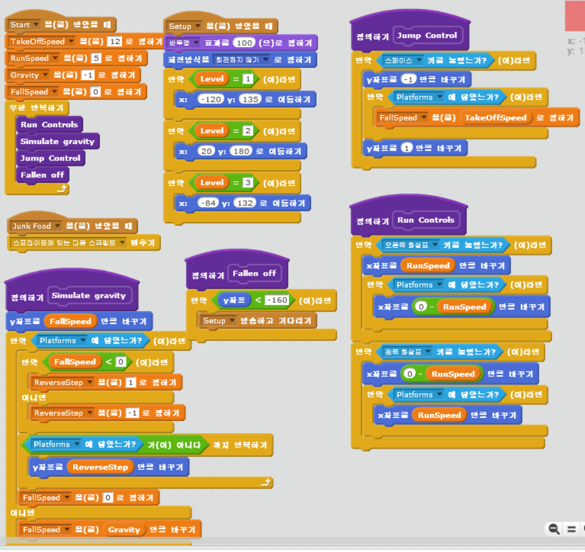

풀랫폼
~~~~~~~~~~~~~~~~
플랫폼은 다음과 같이 코딩한다.

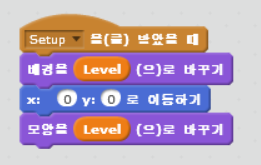

강아지
~~~~~~~~~~~~~~~~
강아지에 대한 코딩은 다음과 같이 한다.

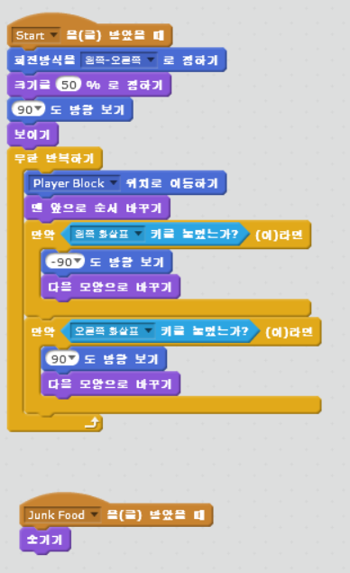

강아지3에 대해서는 다음과 같이 코딩한다.

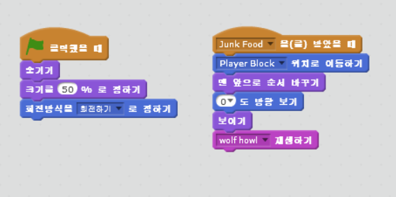

게임 컨트롤
~~~~~~~~~~~~~~~~
게임 컨트롤 스프라이트는 다음과 같다.

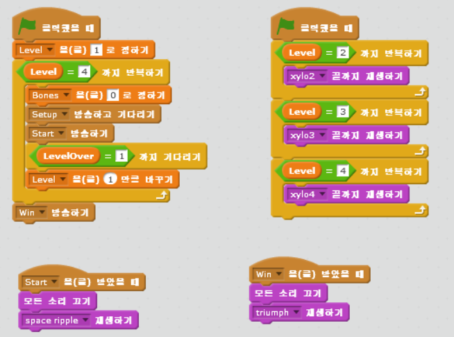

포탈
~~~~~~~~~~~~~~~~
문 역할을 하는 포탈에 대한 스크립트는 다음과 같다.

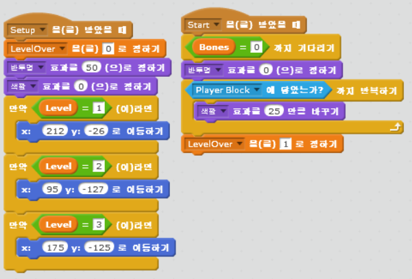

뼈
~~~~~~~~~~~~~~~~
뼈에 대한 스크립트는 다음과 같다.
3개의 뼈는 위치만 다르게 지정하면 된다.

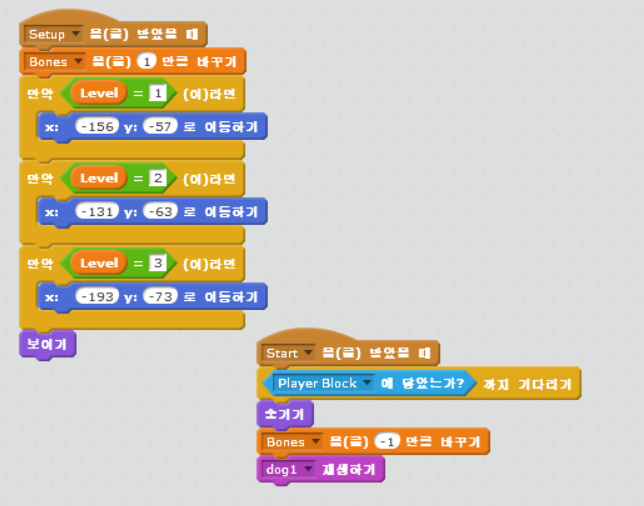

정크푸트
~~~~~~~~~~~~~~~~
정크푸드에 대한 스크립트는 다음과 같다.

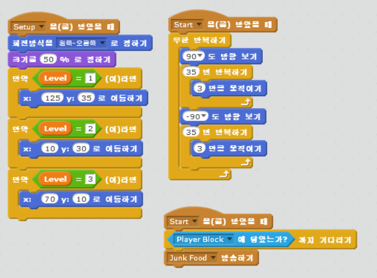

해저드에 해한 스크립트도 다음과 같다.

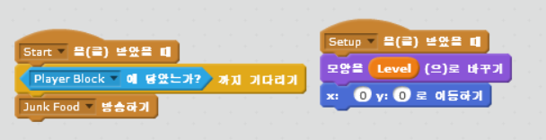

안내
~~~~~~~~~~~~~~~~
안내에 대한 스크립트는 다음과 같다.

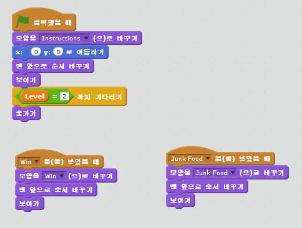
