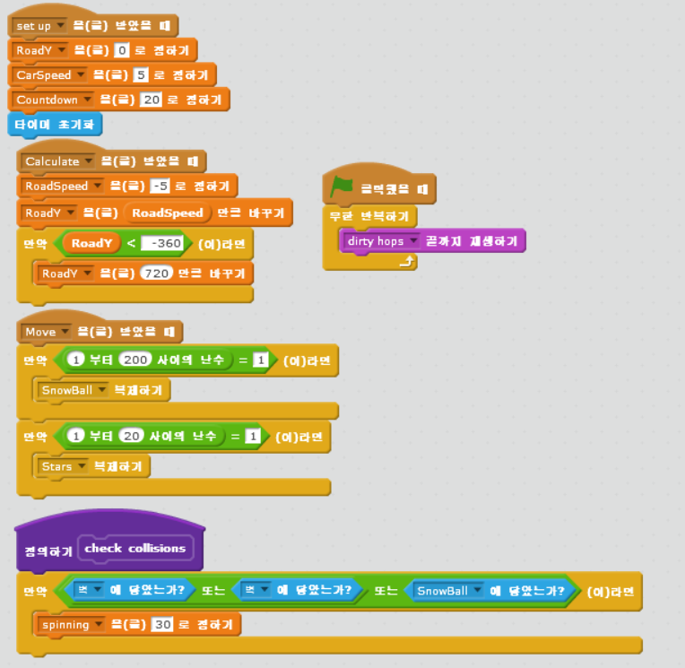

chapter 9: 빙하 경주
==========================

게임의 목적
-----------------------------------

자동차 경주를 하면서 상대방보다 많은 별을 모으는것이  승리하는 것이다.

스프라이트는 다음과 같다.

자동차
~~~~~~~~~~~~~~

장애물
~~~~~~~~~~~~~~

펭귄
~~~~~~~~~~~~~~~~

게임루프
~~~~~~~~~~~~~~~~
게임 루프에 대한 스크립트는 다음과 같다.

길 만들기
~~~~~~~~~~~~~~~~
길에 대한 이미지는 그려진 이미지로 대체하고 대체로 다음과 같이 그린다.

road1에 대한 스크립트는 다음과 같다.

road2에 대한 스크립트는 다음과 같다.

빨간차
~~~~~~~~~~~~~~~~
빨간차에 대한 코딩은 다음과 같이 한다.

파란차
~~~~~~~~~~~~~~~~
파란차에 대한 코딩은 다음과 같이 한다.

스노우볼
~~~~~~~~~~~~~~~~
스노우볼에 대한 코딩은 다음과 같이 한다.

별
~~~~~~~~~~~~~~~~
별에 대한 코딩은 다음과 같이 한다.

