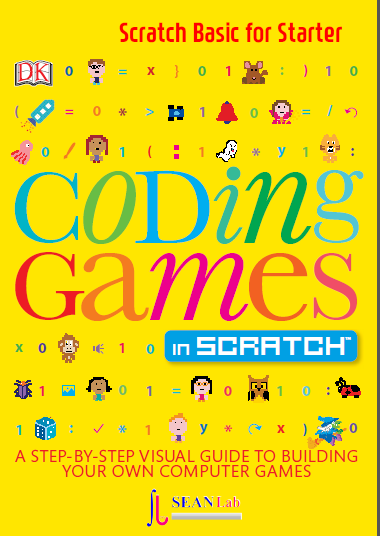

.. sphinxtemp2 documentation master file, created by
   sphinx-quickstart on Sat Nov 10 18:39:39 2018.
   You can adapt this file completely to your liking, but it should at least
   contain the root `toctree` directive.

Starter Scratch Basic
=======================================

 Starter Scratch Basic

      written by sean base on following books

.. image:: ./img/chapter0_4.png

.. toctree::
   :maxdepth: 4

   chapter1-0
   chapter1-1
   chapter1-2

Indices and tables
==================

* :ref:`genindex`
* :ref:`modindex`
* :ref:`search`
